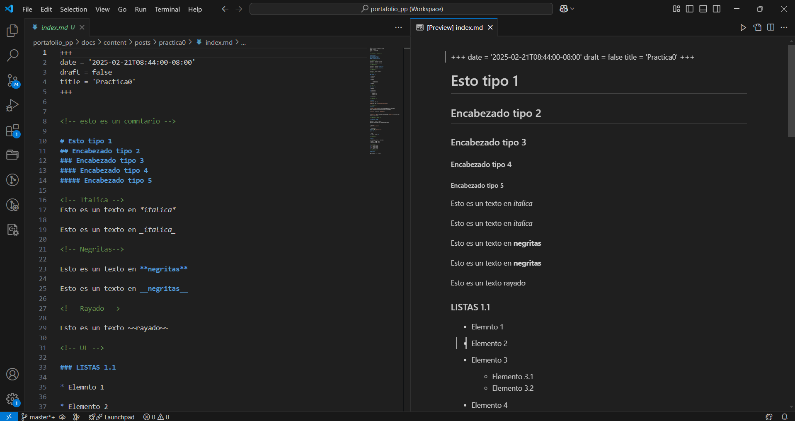
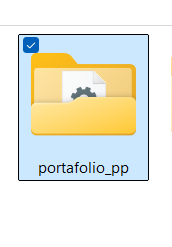

# Resumen de Herramientas Fundamentales de Desarrollo de Software

## **PARADIGMAS DE LA PROGRAMACIÓN**

## **Práctica #0 Uso de Repositorios**

Durante varias sesiones, se llevó a cabo un proceso continuo de aprendizaje sobre herramientas fundamentales de desarrollo de software, incluidos Markdown, Git, GitHub y Hugo. Este ensayo resume las experiencias adquiridas durante dichas sesiones.

## Sintaxis y uso de Markdown

En la primera sesión, se observó la funcionalidad y la sintaxis de Markdown como lenguaje de marcado, utilizado para mejorar la legibilidad en la publicación de páginas estáticas. El docente actuó como guía en el entendimiento de este lenguaje, y los conocimientos adquiridos fueron implementados en un archivo `.md`. En dicho archivo, se experimentó con las distintas sintaxis que ofrece Markdown.

## Uso de Git y GitHub

En la segunda sesión, emprendimos una investigación sobre el uso de Git y GitHub como sistemas de control de versiones para nuestros códigos. Durante esta clase, el docente nos brindó apoyo en la creación de un repositorio en GitHub, lo que nos permitió preservar y compartir nuestros códigos en esta plataforma.

### Comandos de Git

Aprendimos el uso de diversos comandos, entre los cuales se incluyen:

* **Git status**: Muestra el estado actual del repositorio, indicando los archivos modificados, agregados o eliminados, así como los cambios no confirmados.
* **Git commit**: Registra los cambios realizados en el repositorio, creando un nuevo punto en la historia del proyecto con una descripción de los cambios realizados.
* **Git init**: Inicializa un nuevo repositorio Git en el directorio actual, convirtiéndolo en un repositorio de control de versiones.
* **Git push**: Envía los cambios locales realizados en el repositorio al repositorio remoto, actualizando así la versión almacenada en GitHub u otra plataforma.
* **Git add .**: Agrega todos los archivos modificados en el directorio actual al área de preparación (staging area) para su posterior confirmación.
* **Git remote add**: Establece una conexión entre el repositorio local y un repositorio remoto, como GitHub, permitiendo la sincronización de ambos.
* **Touch**: Crea un archivo vacío en el directorio actual o actualiza la fecha y hora de modificación de un archivo existente.
* **Cd**: Cambia el directorio de trabajo actual en el sistema de archivos.
* **Mkdir**: Crea un nuevo directorio en el sistema de archivos.
* **Pwd**: Muestra la ruta absoluta del directorio de trabajo actual.

Estos comandos son usados a lo largo de las prácticas para la gestión de los proyectos que se van elaborando a lo largo de las sesiones.

En clase, se subieron todos nuestros archivos de prueba a un repositorio de GitHub. A medida que avanzaban las sesiones, se creó un portafolio para la materia, ya que continuamente se implementaría código para reforzar la información adquirida.

## Integración de Hugo para la Creación de Sitios Web Estáticos

Finalmente, tuvimos una sesión que combinó tanto Markdown como una nueva herramienta para la generación de sitios web: Hugo. Durante esta sesión, se descargaron los recursos necesarios para integrar ambas herramientas de programación, con el objetivo de generar archivos HTML a partir de archivos `.md`, los cuales son páginas estáticas que se pueden desplegar en servidores web.

Para la correcta ejecución de nuestra página estática, se implementaron los siguientes comandos:

* **hugo serve -D**: Sirve el sitio Hugo localmente, incluyendo borradores.
* **cd ..**: Mueve al directorio superior.
* **git commit -m "chore: mi primer commit"**: Realiza un commit con un mensaje descriptivo.
* **git remote add origin**: Agrega un repositorio remoto en GitHub.
* **git push -u origin master**: Envía los cambios al repositorio remoto en la rama principal.
* **mkdir -p .github/workflows**: Crea el directorio para flujos de trabajo de GitHub Actions.
* **touch .github/workflows/hugo.yaml**: Crea el archivo de flujo de trabajo para Hugo.
* **git commit -m "chore: se creó el archivo hugo.yaml"**: Realiza un commit para el archivo creado.
* **git commit -m "chore: practica0 cambio a publicado"**: Realiza un commit adicional con un mensaje descriptivo.
* **git add .**: Prepara todos los cambios para el siguiente commit.

Durante la práctica se adquirieron conocimientos sobre las herramientas de Markdown, Git, GitHub y Hugo, herramientas que facilitan una gestión eficiente en los proyectos.

