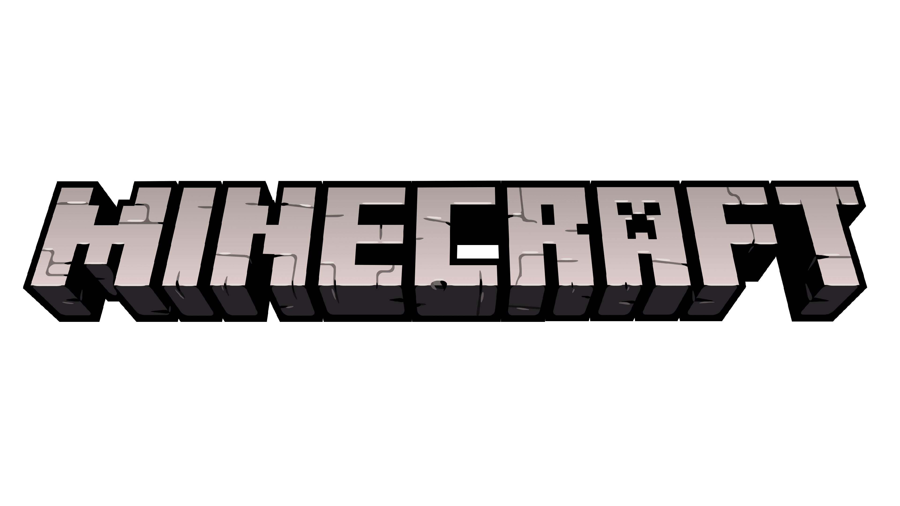

+++
date = '2025-02-21T08:44:00-08:00'
draft = false
title = 'Práctica #0 Markdown, Git y Hugo'
+++


<!-- esto es un comntario -->

# Esto tipo 1
## Encabezado tipo 2
### Encabezado tipo 3
#### Encabezado tipo 4
##### Encabezado tipo 5

<!-- Italica -->
Esto es un texto en *italica*

Esto es un texto en _italica_

<!-- Negritas-->

Esto es un texto en **negritas**

Esto es un texto en __negritas__

<!-- Rayado -->

Esto es un texto ~~rayado~~

<!-- UL -->

### LISTAS 1.1

* Elemnto 1

* Elemento 2

* Elemento 3

    * Elemento 3.1
    * Elemento 3.2

* Elemento 4

<!-- OL -->

### LISTAS 1.2

1. Elemnto 1

2. Elemento 2

3. Elemento 3

    Elemento 3.1
    Elemento 3.2

4. Elemento 4


<!-- Enlaces -->

# Enlaces

[UABC](www.uabc.mx)

[UABC](www.uabc.mx "Título personalizado")

<!-- Imágenes -->

# Imágenes


[](https://www.minecraft.net/es-es)


<!-- Bloques de código -->

# Bloques de código

```
Esto es un bloque de código
Esto es una segunda línea de bloque de código
```

```python
printf("Hello World")
```

```javascript
console.log ('Hello World')

const test = ()
```

```html
<h1> Hello World </h1>
```

<!-- Tablas -->

# Tablas

| Productos | Precio | Cantidad |
| - | - | - |
| Laptop | 20,000 | 6 |
| Celular | 5,000 | 2 |

<!-- Tareas -->

* [x] Primera tarea
* [ ] Segunda tarea
* [x] Tercera tarea
* [ ] Cuarta tarea

<!-- Menciones -->

# Menciones

@darthrookie : +1 : smile