+++ date = '2025-03-11T10:19:41-08:00' 
draft = false 
title = 'Práctica #1 Elementos Básicos de los Lenguajes de Programación' 
+++

# **PARADIGMAS DE LA PROGRAMACIÓN**

## Identificación de elementos en los lenguajes de programación

En la práctica de taller, el docente proporcionó un código fuente con el que se experimentó. Este código contenía un programa con elementos que el alumno identificó.

# Análisis de Código en C: Gestión de Memoria y Biblioteca

## 1. Nombres (Identificadores)

### a. MEMORY_MANAGEMENT_H
Es un nombre de archivo de cabecera utilizado para evitar la inclusión múltiple del archivo.

### b. MEMORY_MANAGEMENT_DISPLAY
Es una macro de preprocesador utilizada para controlar si se debe mostrar la información sobre el uso de memoria.

### c. heap_allocations
Son variables externas que almacenan contadores de las asignaciones y liberaciones de memoria en el heap y la pila.

---

## 2. Objetos en el Código

### a. MemoryRecord
Es una estructura que actúa como un "objeto" en el contexto de esta práctica, ya que contiene información sobre las asignaciones de memoria (puntero y tamaño) en el heap.

### b. Punteros dentro de MemoryRecord
Los punteros `pointer` dentro de `MemoryRecord` son objetos que apuntan a las áreas de memoria asignadas dinámicamente.

---

## 3. Entornos

### a. Entorno de Compilación
El entorno de compilación incluye la directiva `#if MEMORY_MANAGEMENT_DISPLAY` que condiciona la inclusión del código de visualización de memoria.

---

## 4. Bloques

### a. Definición de Bloques
Los bloques son unidades de código entre llaves `{}`. Se utilizan para agrupar instrucciones en funciones o condicionales.

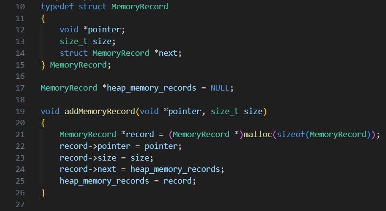
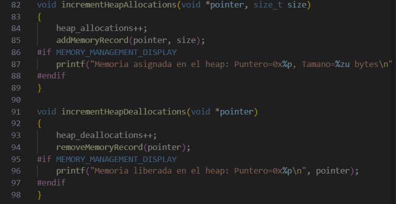

---

## 5. Alcance (Scope)

### a. Variables en Alcance Global
Las siguientes variables se encuentran en alcances globales, lo que significa que pueden ser accedidas en cualquier parte del código.

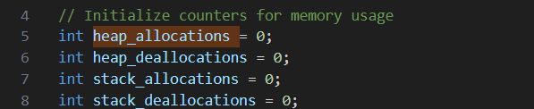

---

## 6. Administración de Memoria

### a. Uso de `malloc` y `free`
Este código realiza administración de memoria dinámica utilizando `malloc` y `free`, tanto en el heap como en la pila.

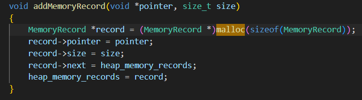

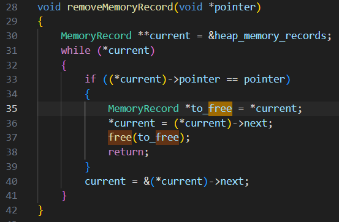

---

## 7. Expresiones

### a. Cálculo de Valores
En el código se encuentran expresiones utilizadas para calcular valores, como el tamaño de la memoria y la verificación de condiciones.

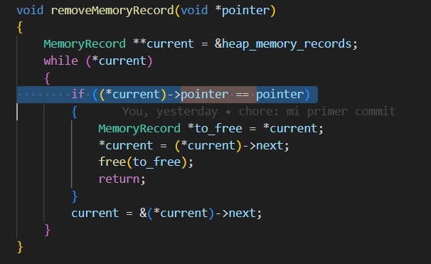

---

## 8. Comandos

### a. Instrucciones Comunes
Los comandos son instrucciones que indican acciones a realizar, tales como:

- `scanf()`
- `printf()`
- `malloc()`
- `free()`

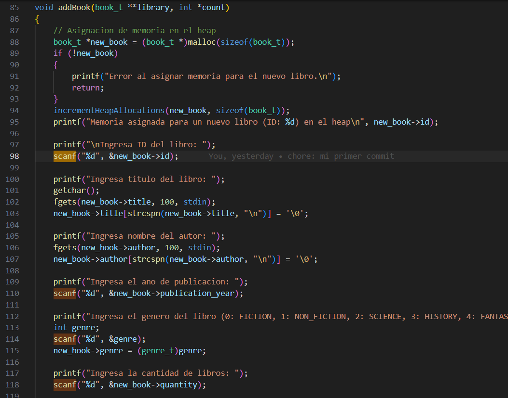

---

## 9. Secuencia

### a. Ejecución Secuencial
Cuando el usuario elige una opción en el menú de la función `main()`, el programa ejecuta las instrucciones correspondientes a esa opción en secuencia.

### b. Variabilidad de la Secuencia
Dependiendo de cómo los usuarios ejecuten las funciones, serán las secuencias del código.

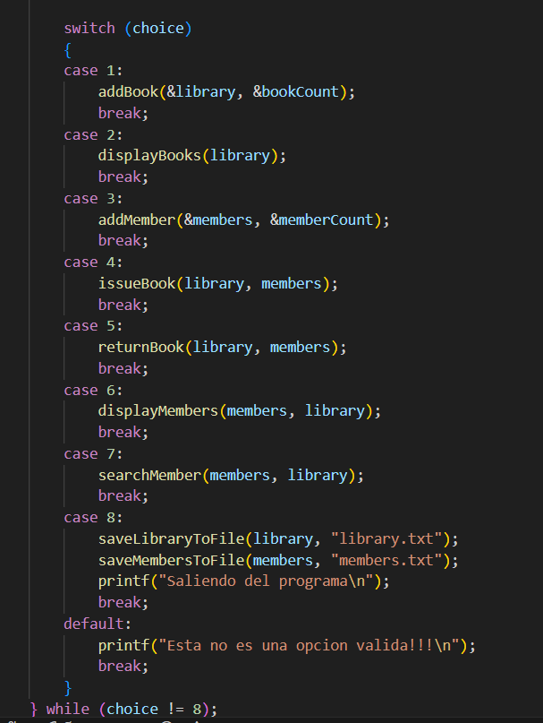

---

## 10. Selección

### a. Estructuras de Selección
Se utilizan las estructuras `if` y `switch` para tomar decisiones dentro del código:

- `if (bookFound && memberFound)` en funciones como `issuesBook()` y `returnBook()` para verificar si un libro y un miembro existen antes de proceder.
- `switch (choice)` en `main()` para manejar la opción seleccionada por el usuario.

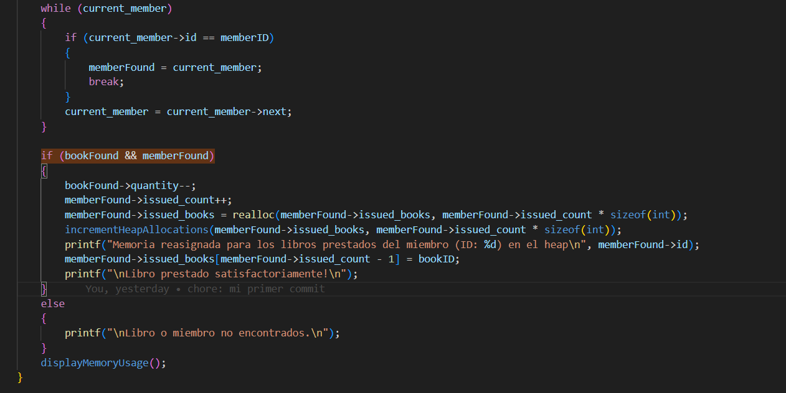

---

## 11. Iteración

### a. Ciclos de Iteración
Se utilizan ciclos `while` y `for` para iterar sobre las listas de libros y miembros de la biblioteca.

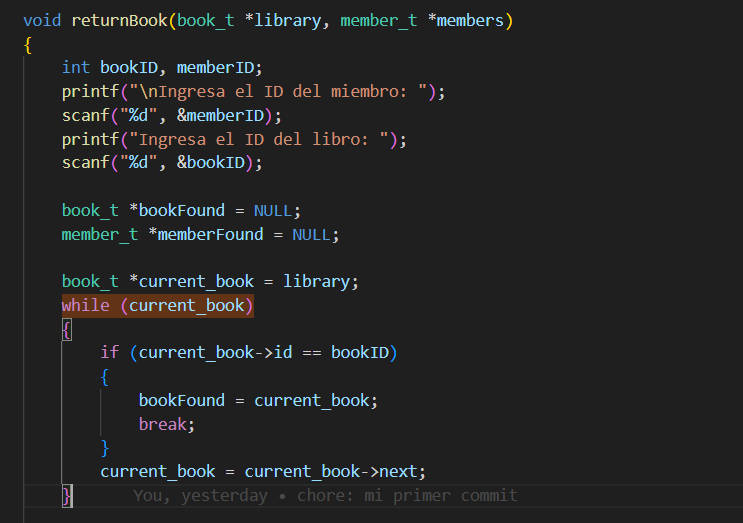

---

## 12. Recursión

### a. Función Recursiva
Se utiliza recursión para recorrer toda la lista de libros de la biblioteca y mostrarlos.

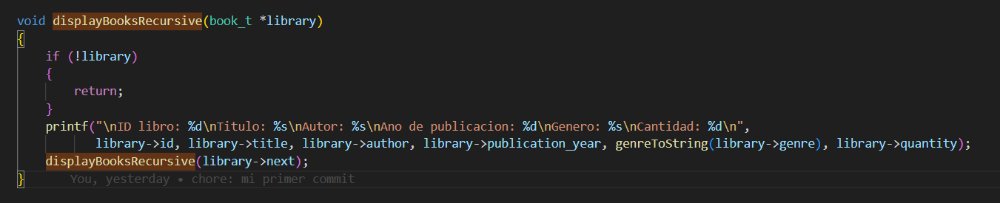

---

## 13. Subprogramas

### a. Funciones Específicas
El código hace uso de varias funciones o subprogramas que realizan tareas específicas. Algunas de las funciones son:

- `addBook()`: agrega un nuevo libro a la biblioteca.
- `displayBooks()`: muestra los libros disponibles.
- `issuesBook()`: gestiona el préstamo de un libro.
- `freeLibrary()`: libera la memoria asignada a la biblioteca.
- `saveLibraryToFile()`: guarda la biblioteca en un archivo.

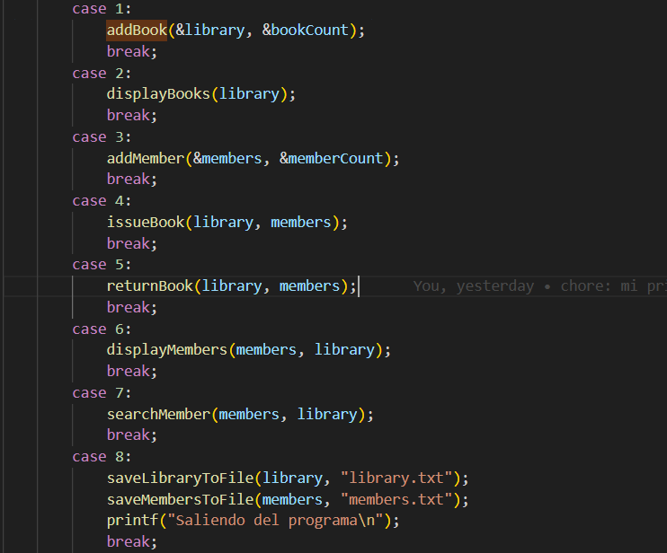

---

## 14. Tipos de Datos

### a. Tipos de Datos Utilizados

- **Tipos Primitivos**: `int`, `char`, `size_t`, etc.
- **Tipos Definidos por el Usuario**:
  - `género_t`: una enumeración que representa géneros de libros.
  - `book_t` y `member_t`: estructuras que representan libros y miembros en la biblioteca.