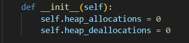
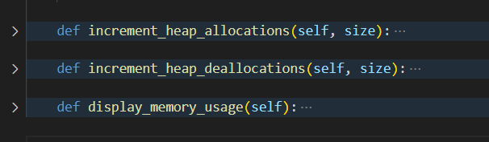
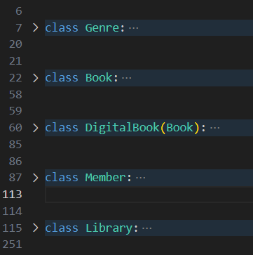
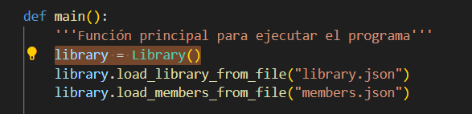
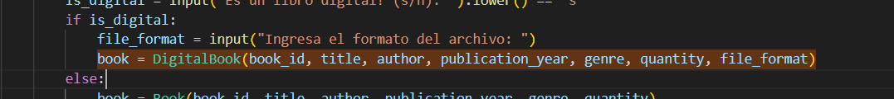
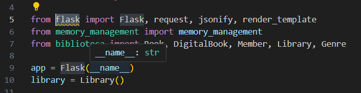
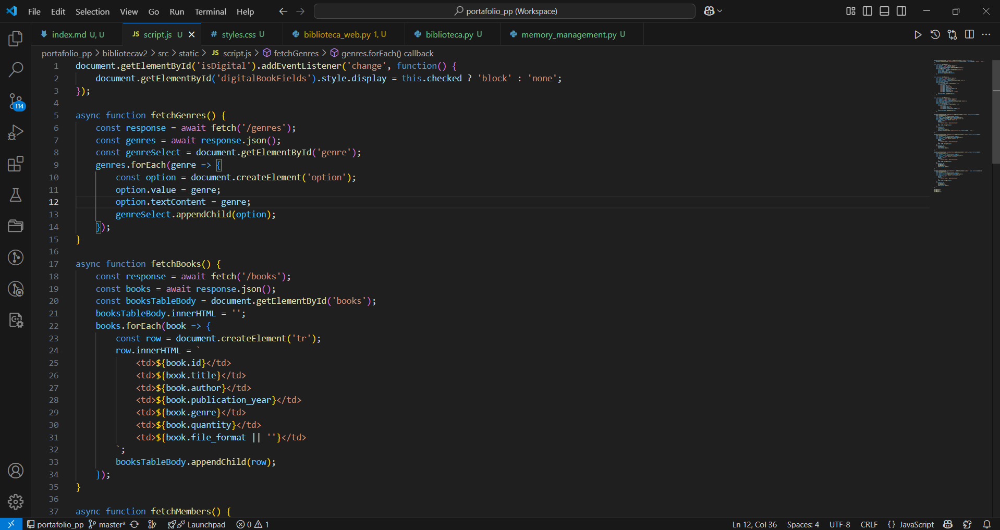
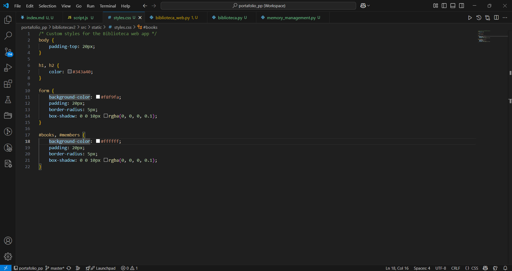
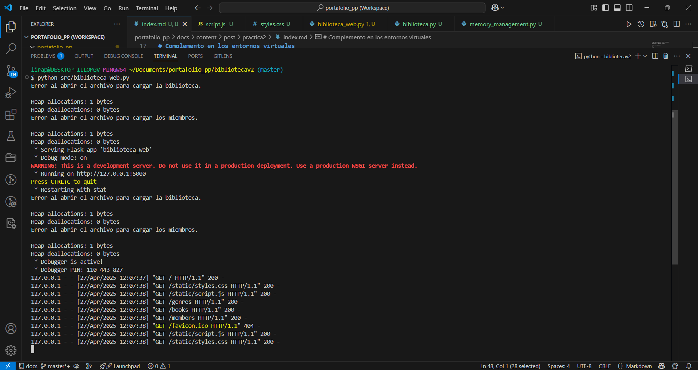
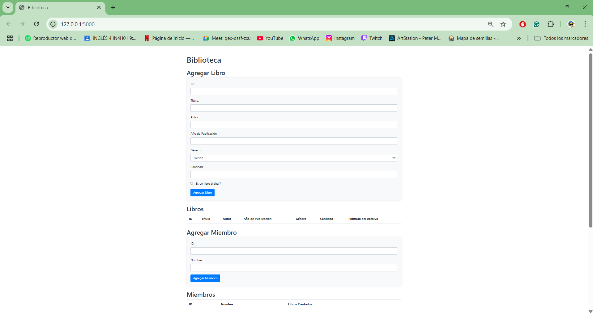

+++ date = '2025-03-30T10:19:41-08:00' 
draft = false 
title = 'Práctica #2 El Paradigma Orientado a Objetos' 
+++

# **PARADIGMAS DE LA PROGRAMACIÓN**

## Identificación de elementos en el Paradigma Orientado a Objetos

En la práctica de taller, el docente proporcionó un código fuente con el que se experimentó. Este código contenía un programa con elementos que el alumno identificó.

# Análisis de Código en Python: Conceptos

## memory_management.py

El código está diseñado para el gestionamiento de la memoria en asignaciones y desasignaciones que están en los otros dos códigos complementarios.

### `memory_management.py` contiene:
1. **Atributos de clase**:
   - `self.heap_allocations`: Lleva un contador que se le asigna en el heap.
   - `self.heap_deallocations`: Lleva un contador que se libera en el heap.

   
2. **Métodos**:
   - `increment_heap_allocations(self, size)`: Incrementa el contador `heap_allocations` con el tamaño de una nueva asignación de memoria.
   - `increment_heap_deallocations(self, size)`: Incrementa el contador `heap_deallocations` con el tamaño (en bytes) de una liberación de memoria.
   - `display_memory_usage(self)`: Imprime el uso total de la memoria asignada y liberada, mostrando ambos valores en bytes.

## biblioteca.py

El código es un sistema de gestión de biblioteca que almacena y agrega libros categorizados por autor y género. Además, crea un registro de miembros y un sistema de préstamo y devolución de libros. Guarda y carga los datos desde archivos.

### `biblioteca.py` contiene:
1. **Clases**:
   - **Genre**: Define el género del libro.
   - **Book**: Define la estructura del libro, asignándole un ID, título, año de publicación y cantidad disponible.
   - **DigitalBook**: Subclase de `Book` que agrega un atributo adicional para el formato de archivo.
   - **Member**: Define los miembros de la biblioteca, incluyendo su ID y nombre.

2. **Objetos**:
   - `library`: Objeto de la clase `Library` que representa una biblioteca en funcionamiento.
   - `book`, `member`: Son objetos que se crean en las clases anteriormente mencionadas.

## biblioteca_web.py

En el código `biblioteca_web.py` se implementa una aplicación utilizando Flask para permitir operaciones CRUD (Crear, Leer, Actualizar, Eliminar). Más adelante en el documento se muestra la implementación en la web.

El código gestiona la biblioteca, agrega libros, agrega miembros, presta o devuelve los libros a los miembros y guarda y carga los datos de la biblioteca en archivos JSON para almacenarlos.

## Conceptos Fundamentales

### Encapsulamiento
El encapsulamiento es un principio metodológico en programación que se refiere a la capacidad de ocultar el estado interno de una variable y restringir el acceso a sus propiedades.

### ADT (Abstract Data Type)
Los ADT garantizan el encapsulamiento y ocultamiento de información, pero son rígidos cuando se utilizan en un diseño con un mayor grado de complejidad.

### Objetos
Los objetos son una cápsula que contiene datos y las operaciones para manipularlos. Proveen una interfaz con el mundo exterior a través de la cual el objeto es accesible.

### Operaciones
Las operaciones, también llamadas métodos, pueden acceder a los elementos de datos contenidos en el objeto, los cuales se llaman variables de instancia (o miembros o campos).

### Clases
Una clase es un modelo para un conjunto de objetos. Establece qué atributos existen y fija un nombre, una firma, visibilidad e implementación para cada uno de sus métodos.

### Tipo de Almacenamiento
La solución más común es que los objetos sean almacenados en el stack y se obtiene acceso a ellos por referencia almacenada en el heap. Estos serán punteros reales en los lenguajes que lo permiten o variables si el lenguaje soporta el modelo de referencia.

### Encapsulamiento
Encapsulamiento y ocultamiento de información representan dos de los puntos cardinales de la abstracción de datos.

### Subtipos
La definición de una clase introduce la definición de un tipo de dato cuyos valores son las instancias de esa clase.

### Herencia
La herencia es una de las características principales de la programación orientada a objetos. Existen varios tipos de herencia:
- Herencia sencilla
- Herencia múltiple
- Herencia multinivel
- Herencia jerárquica
- Herencia híbrida

### Polimorfismo y Genéricos

#### Polimorfismo
El polimorfismo como concepto general nos indica la capacidad de algo de adoptar varias formas.

#### Subtipo
El polimorfismo de subtipo es el tipo más común. Suele ser el que se menciona cuando se dice: "El objeto es polimórfico".

#### Polimorfismo Paramétrico
Este tipo proporciona específicamente una forma de usar una función (el mismo código) para interactuar con múltiples tipos. Este tipo se valida en tiempo de compilación. También se conoce como sobrecarga de funciones (function overloading).

# Complemento en entornos virtuales

Para complementar la práctica de taller, el maestro ayudó al alumno a implementar entornos virtuales con los siguientes comandos:

- `python -m virtualenv env`: Crea un entorno virtual llamado `env` usando el módulo `virtualenv`. Esto aísla las dependencias de Python para el proyecto específico.
- `ls`: Lista los archivos y carpetas del directorio.
- `ls env`: Lista el contenido dentro de la carpeta `env`.
- `ls env/lib`: Muestra las librerías del entorno.
- `ls env/Scripts`: Lista el contenido del directorio `Scripts`.
- `source env/Scripts/activate`: Activa el entorno virtual desde el script de activación.
- `cd bibliotecav2`: Entra al directorio `bibliotecav2`.
- `pip install flask`: Instala Flask dentro del entorno virtual activado.
- `python src/biblioteca_web.py`: Ejecuta el archivo para iniciar la aplicación de Flask, visualizándola en la web.

Con el entorno virtual activo, podemos ingresar a él:

Código script usado en Java Script.

Código usado para estilizar la web.

Activación en VSCODE, para ingresar a la URL.

## Entorno Virtual de la Implementación en Python

Visualización del entorno.