+++ date = '2025-05-02T10:19:41-08:00' 
draft = false 
title = 'Práctica #3 El Paradigma Funcional' 
+++

# **PARADIGMAS DE LA PROGRAMACIÓN**

## Elementos e Implementación del Paradigma Funcional

En la práctica de taller, se descargó e instaló un entorno llamado Docker, y se siguió un tutorial de Haskell para aprender cómo interactuar con el lenguaje de programación a través del código.

# Análisis de Código en Haskell: Entorno

## PRIMERA SESIÓN

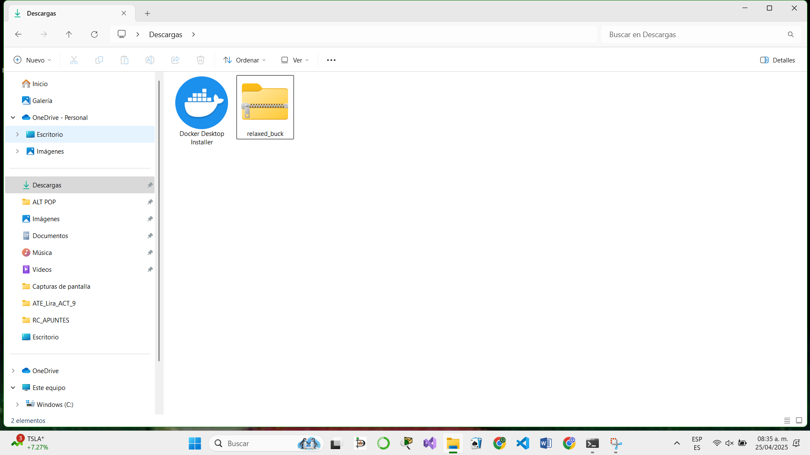

En la primera sesión se instaló Docker, siendo una plataforma de código abierto que facilita la creación, distribución y ejecución de aplicaciones a través de contenedores. Los contenedores son unidades de software estandarizadas que incluyen todo lo necesario para que la aplicación se ejecute, como el código, el entorno de ejecución, las herramientas del sistema y las dependencias.

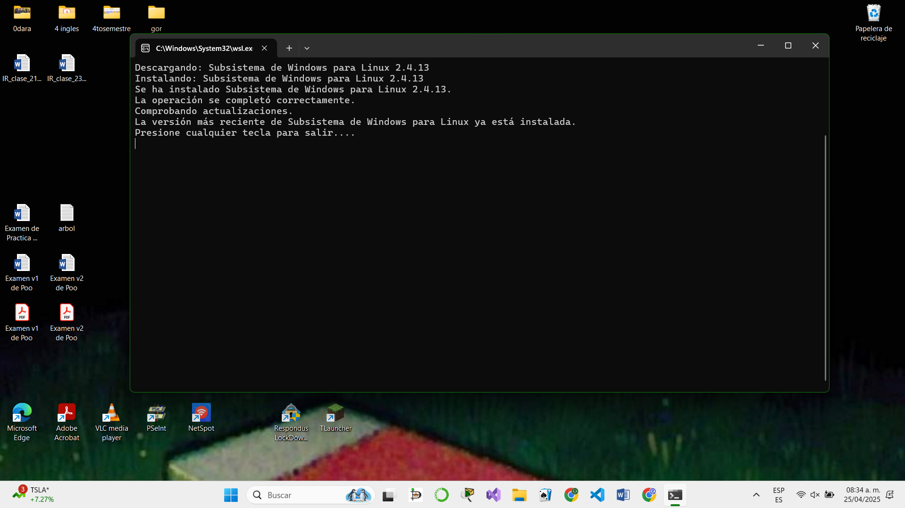

Para lograr la descarga completa, se tuvo que descargar una distribución compatible con Linux.

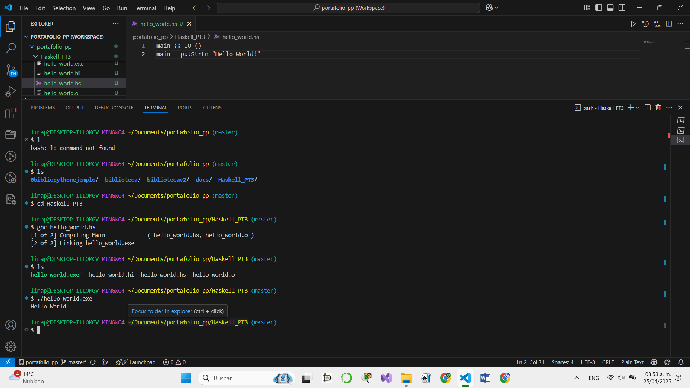
Teniendo el entorno en el equipo, se creó una nueva carpeta en nuestro portafolio de prácticas para interactuar con el lenguaje Haskell.

## SEGUNDA SESIÓN
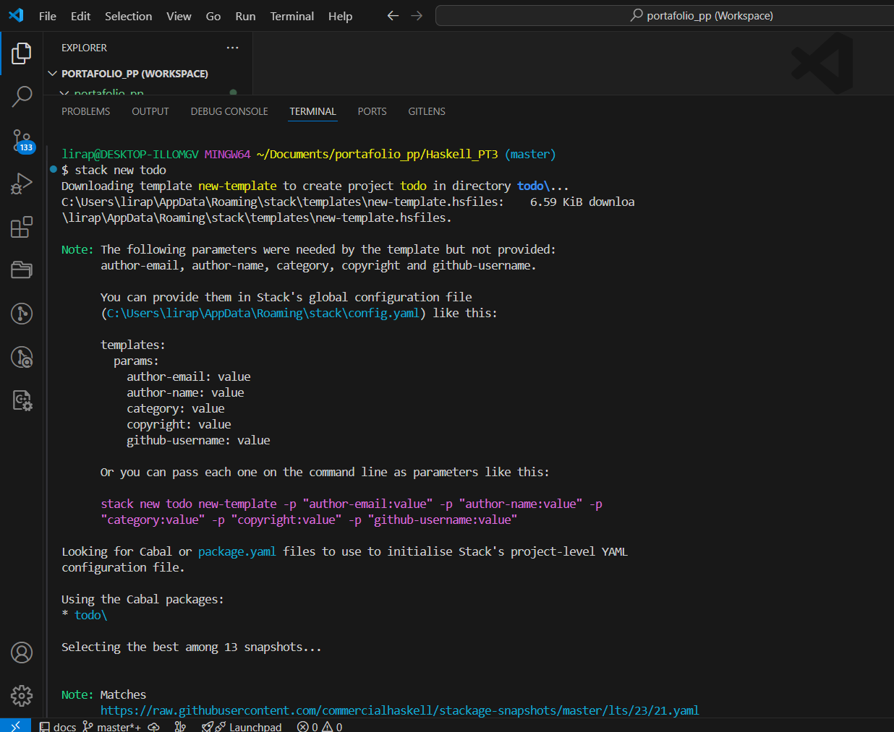

En la segunda sesión, el alumno experimentó con un tutorial, que contenía los pasos necesarios para la creación de una aplicación.

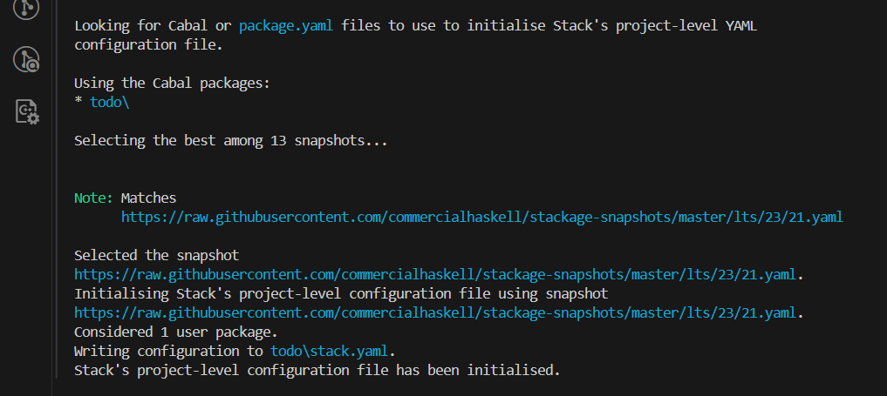
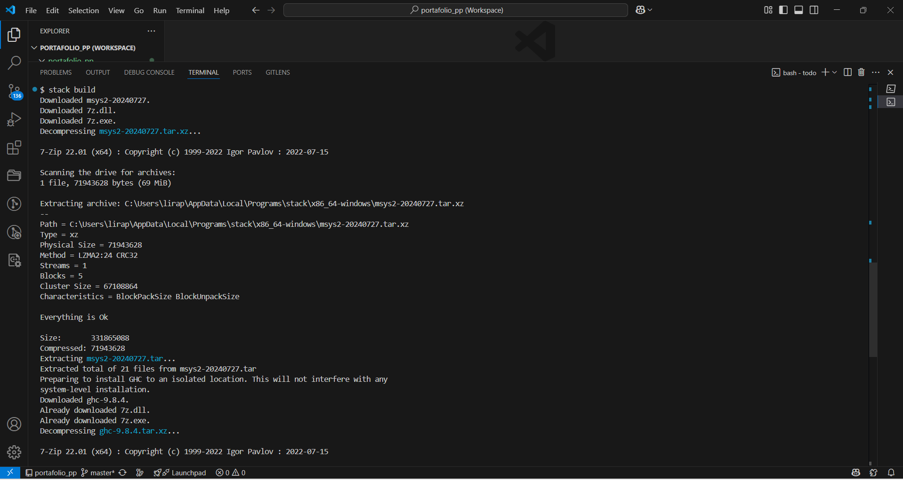
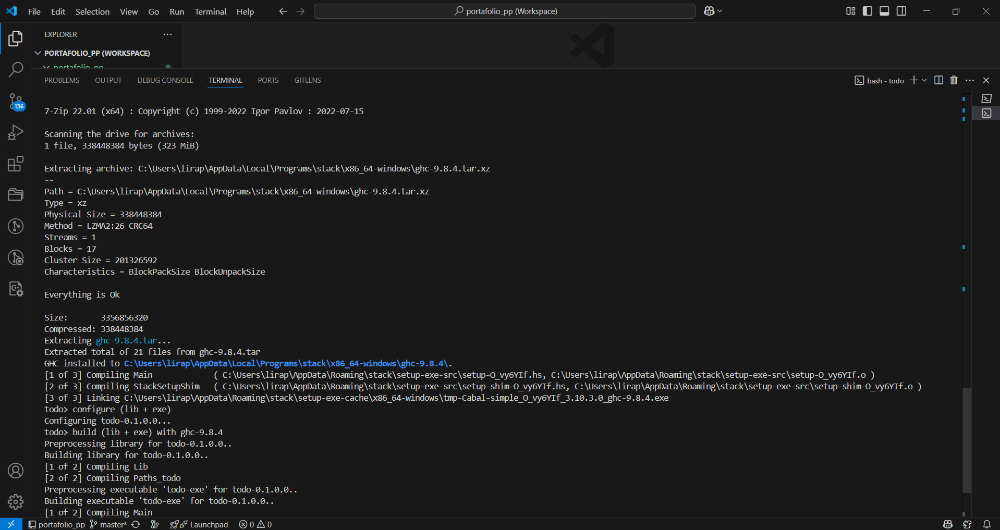
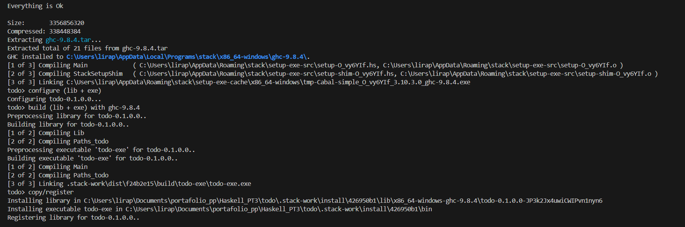

El comando `$ stack new todo new-template` crea un nuevo proyecto de Haskell llamado "todo" utilizando la plantilla `new-template`. Durante este proceso, Stack descarga la plantilla del repositorio correspondiente y configura el proyecto.

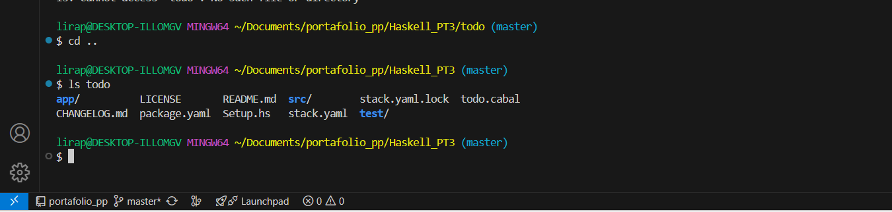

Con el comando `ls`, se puede observar todas los archivos contenidos en la carpeta `todo`.

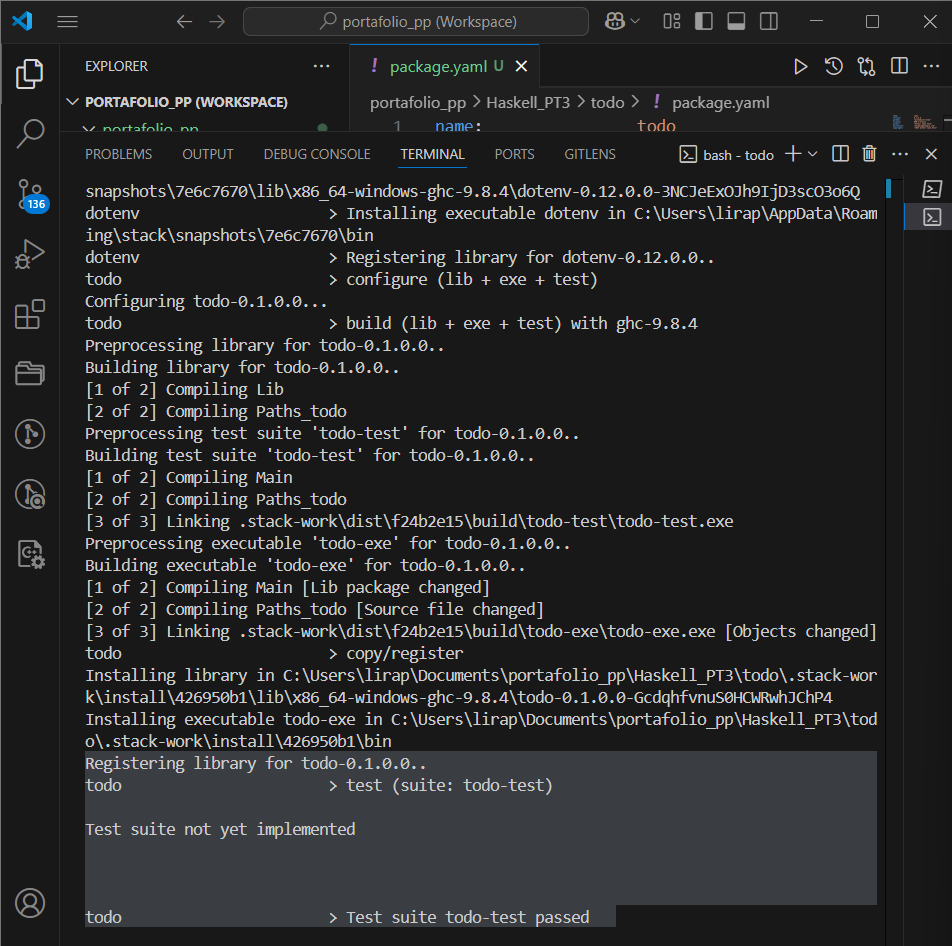

El comando `$ stack test` ejecuta las pruebas asociadas al proyecto Haskell que se ha creado, en este caso el proyecto `todo`. Primero, Stack registra la biblioteca principal del proyecto con la versión correspondiente, lo cual es parte de la configuración inicial. Luego, intenta ejecutar la suite de pruebas definida para el proyecto, pero dado que no se han implementado pruebas aún (como es típico en un proyecto recién creado), muestra un mensaje indicando que la suite de pruebas no está implementada.

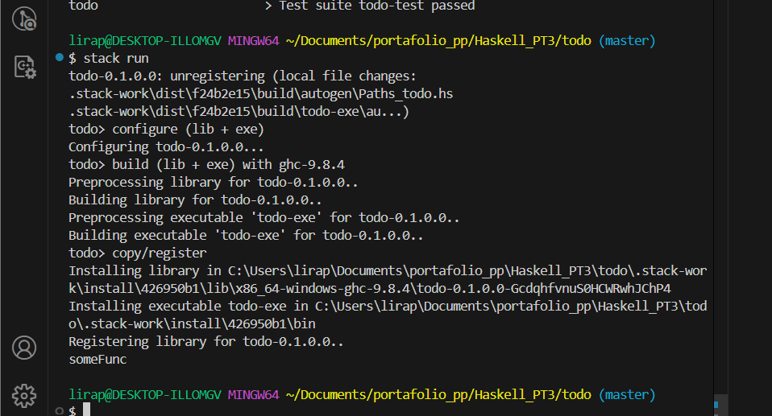

El comando `$ stack run` ejecuta el proyecto Haskell que ha creado. Al ejecutar este comando, Stack compila y corre el programa, mostrando el resultado en la consola. En este caso, el mensaje `someFunc` es la salida por defecto que proporciona la plantilla inicial del proyecto. Esto indica que el proyecto se ha compilado correctamente y que el entorno está listo para ser editado.

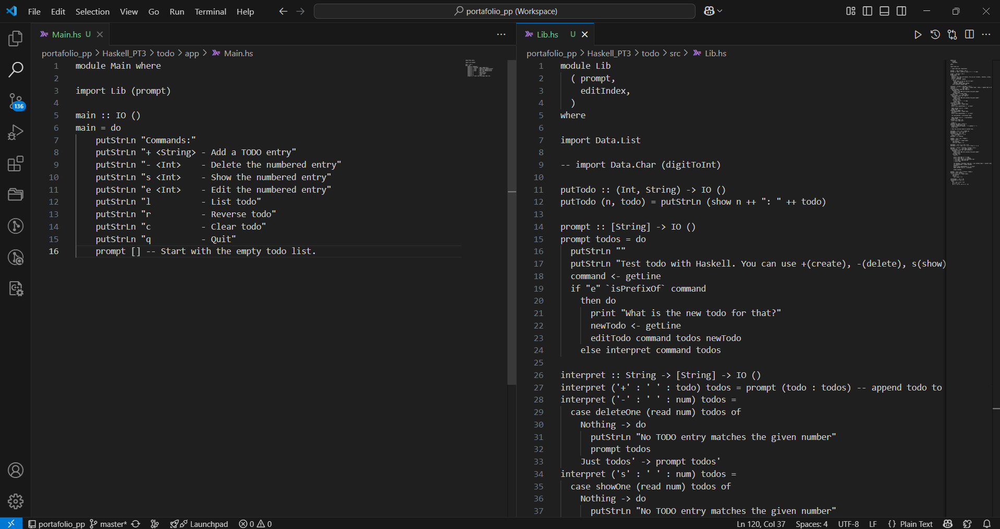

En `Main.hs`, se configura la interfaz de usuario que muestra los comandos disponibles y llama a la función `Prompt` (importada de `Lib.hs`) para gestionar la interacción. Los comandos incluyen agregar (`+`), eliminar (`-`), mostrar (`s`), editar (`e`), listar (`l`), invertir (`r`), limpiar (`c`) y salir (`q`). Por otro lado, en `Lib.hs`, se maneja la lógica principal de la aplicación. La función `Prompt` se encarga de mostrar un mensaje inicial y leer la entrada del usuario.

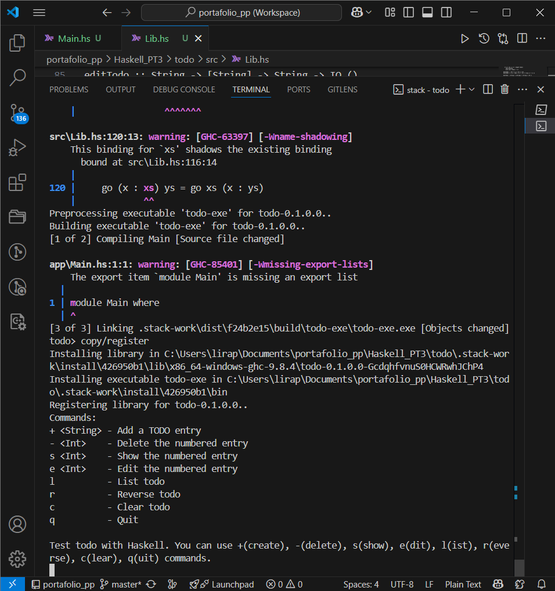

Uso de la aplicación. En la interfaz se interactuó para ver su funcionamiento.

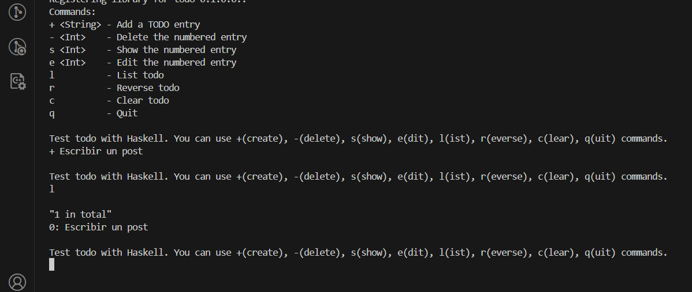
Se agregó una primera entrada con el menú del código.

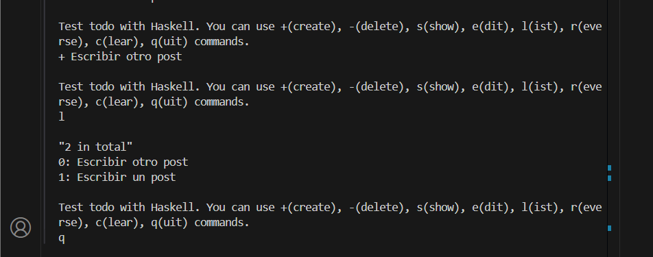

Se adicionó una segunda entrada.

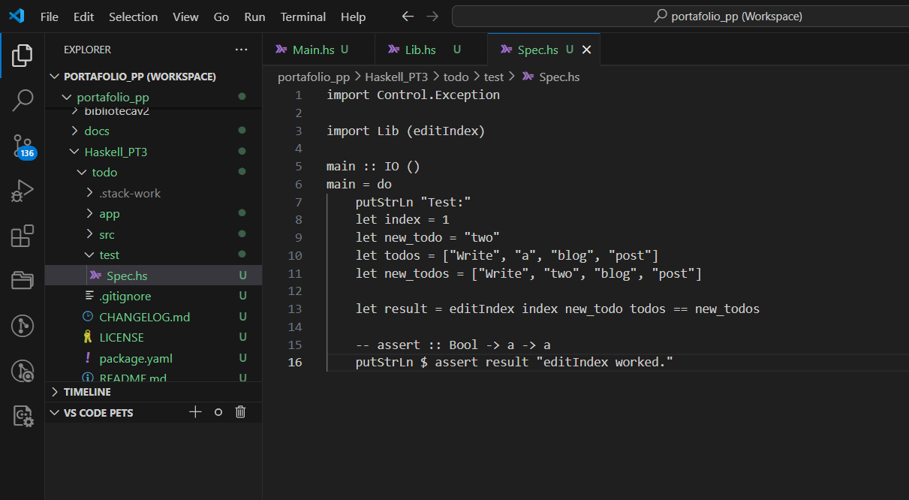

Se agregó código en el archivo `Spech.hs`. El código está realizando una prueba unitaria sobre la función `editIndex`, que debe reemplazar un valor en una lista de tareas en un índice dado. Si la función funciona correctamente, aparecerá el mensaje `"editIndex funcionó"` en la consola. Si hay un error, el programa lanzará una excepción. Es una forma de verificar si la lógica de la función `editIndex` es correcta.

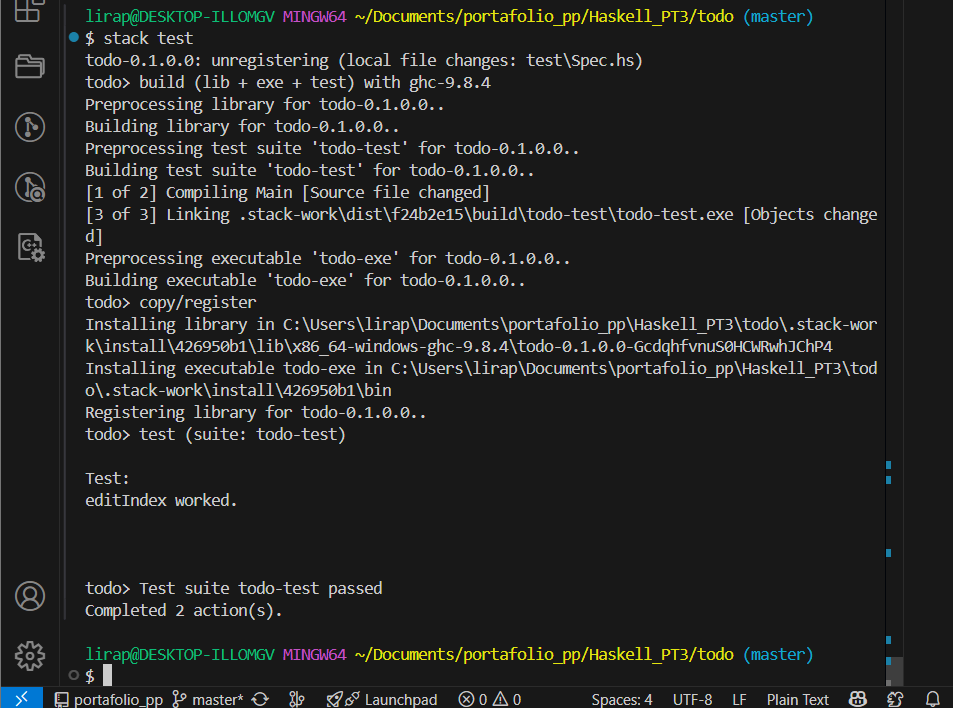

Al ejecutar el comando `$ stack test` en la terminal Git Bash, Stack procede a compilar todo el proyecto, lo que incluye tanto el archivo `Lib.hs` como el archivo de pruebas ubicado en `test/Spec.hs`. Posteriormente, se ejecuta la función principal definida en dicho archivo de pruebas, lo que permite verificar el correcto funcionamiento del código mediante los casos de prueba especificados.

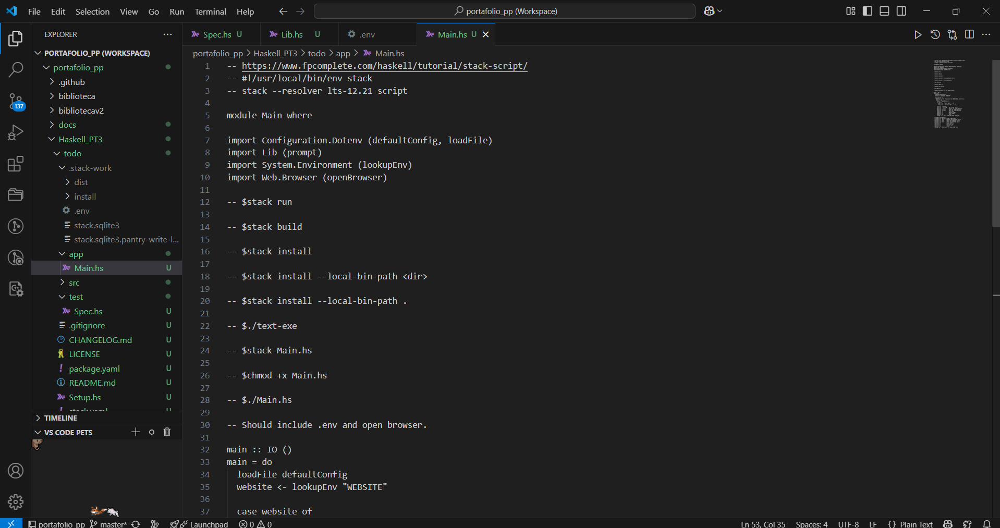

El código Haskell demuestra cómo usar paquetes externos como `dotenv` para cargar variables de entorno desde un archivo `.env` y `open-browser` para abrir una URL en el navegador desde la línea de comandos. Al iniciar, el programa carga el archivo `.env`, obtiene la variable `WEBSITE`, y si está definida, abre esa URL en el navegador.

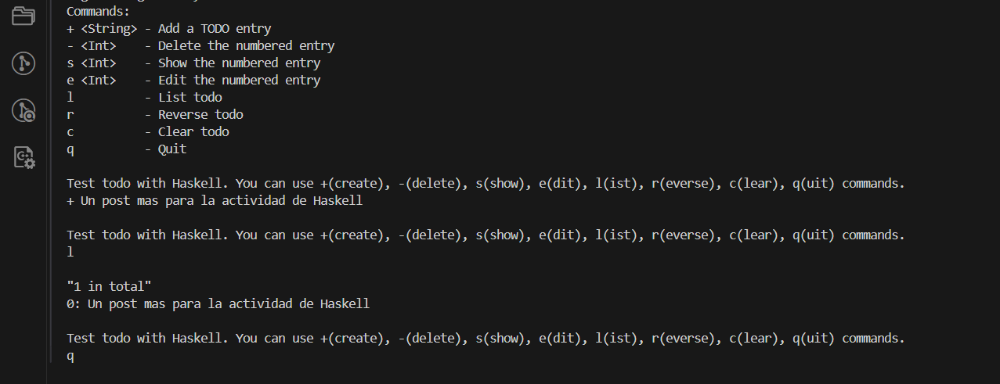

Se agregó una última entrada para probar el código.

## Conceptos fundamentales

### Cómputo sin estado
El estado de una máquina de estados depende de entradas previas. Al procesar una nueva entrada, el sistema cambia de estado. En contraste, en programación funcional, las funciones se diseñan para ser sin estado, es decir, su salida depende únicamente de las entradas que reciben, y no de un estado anterior.

### Funciones puras
Una función pura siempre produce la misma salida para los mismos argumentos y no depende de ningún estado externo ni cambia el estado del sistema (sin efectos secundarios).

### Recursividad
En lugar de usar bucles `for` o `while` (como en la programación imperativa), la iteración en programación funcional se implementa mediante recursión. Las funciones recursivas se llaman a sí mismas repetidamente hasta alcanzar un caso base.

### Transparencia referencial
La transparencia referencial significa que una expresión puede ser reemplazada por su valor sin cambiar el comportamiento del programa. En los lenguajes funcionales, una vez que se define una variable, su valor no cambia durante la ejecución del programa.

---
## Expresiones y funciones en programación funcional

1. **Ambigüedad en las expresiones matemáticas:**
   En matemáticas, la expresión `f(x)` puede tener dos significados diferentes según el contexto:

   a. **Definir la función:** Al escribir `f(x) = x^2`, estamos definiendo la función `f` que asocia a cada valor de `x` su cuadrado.  
   b. **Aplicar la función:** Al escribir `f(2)`, estamos aplicando la función `f` al valor 2, lo que resulta en 4.

2. **Diferenciación de estos significados en lenguajes artificiales:**
   En los lenguajes de programación, es importante distinguir entre:

   a. El nombre de la función (como `f`).  
   b. El cuerpo de la función (el conjunto de reglas o instrucciones que definen lo que hace la función, como `x * x`).

   Para resolver esta ambigüedad, se utilizan técnicas de notación clara que permiten identificar cuando se está definiendo la función y cuando se la está aplicando.

---

## Definición y aplicación de funciones en lenguajes funcionales
1. En lenguajes funcionales como ML o Haskell, podemos utilizar una notación para expresar la definición de funciones de manera clara:

   a. **Definición de función:** Usamos una expresión como `val f = fn x => x * x;` para definir una función `f` que toma un argumento `x` y devuelve `x * x` (el cuadrado de `x`).

   b. Esta definición es un ejemplo de cómo se separa la introducción del nombre de la función (en este caso `f`) de su aplicación.

---

## Diferencias entre procedimientos y funciones
1. Las funciones devuelven un valor, los procedimientos pueden devolver 0, 1, ó n valores y en forma de lista de parámetros.  
2. El procedimiento se declara igual que una función, pero su nombre no está asociado a ninguno de los resultados que obtiene.  
3. Las funciones solo tienen parámetros de entrada, en cambio los procedimientos pueden tener de entrada, salida, y/o entrada/salida.

---

## Cómputo como reducción
El cómputo como reducción es un enfoque en la programación funcional que se basa en reescribir o transformar expresiones complejas paso a paso hasta llegar a un valor final. Este proceso se denomina **reducción**, y tiene como objetivo simplificar o resolver una expresión de acuerdo con ciertas reglas, especialmente en lenguajes funcionales.

- **Redex (Expresión Reducible):** Una redex (del inglés *reducible expression*) es una aplicación de función que está lista para ser evaluada.  
- **Reductum:** El reductum de una redex es el resultado de realizar la reducción de la redex.  
- **Regla β (Reducción β):** La regla β describe el proceso de reducción de una redex.  
- **Valor:** Es una expresión que no se puede reescribir más.  
- **Evaluación por valor:** Solo se evalúa la redex si su argumento ya es un valor.  
- **Evaluación por nombre:** No se evalúa el argumento hasta que se usa.  
- **Evaluación Perezosa:** Evalúa las expresiones solo cuando es necesario.

---

## Comparación de Estrategias de Evaluación
Se refiere al análisis de diferentes estrategias de evaluación de expresiones en un lenguaje de programación funcional, en particular la comparación entre evaluación por nombre (*call-by-name*) y evaluación por valor (*call-by-value*).

---

## Ventajas
1. **Facilidad de entendimiento y depuración:**  
   Las funciones puras son más fáciles de entender porque no dependen de un estado global o cambiante, sino solo de sus entradas. Esto hace que el código sea predecible y fácil de depurar.

2. **Mayor modularidad y reutilización:**  
   La capacidad de tratar funciones como valores (pasarlas como parámetros o retornarlas como resultados) aumenta la modularidad y facilita la reutilización de código.

---

## Desventajas
1. **Desafíos con la recursión:**  
   La recursión puede ser difícil de comprender y usar correctamente. Es especialmente desafiante para quienes están acostumbrados a trabajar con bucles `for` o `while`, y puede no ser tan eficiente en algunos casos, debido al consumo de memoria y la profundidad de las llamadas.

2. **Dificultad para manejar E/S (entrada/salida):**  
   Las operaciones de entrada/salida (E/S) son complicadas en la programación funcional porque no se pueden realizar en funciones puras sin efectos secundarios. Manejar E/S en un paradigma funcional requiere técnicas avanzadas (como mónadas en Haskell) para mantener la pureza del código.

---

## Aplicaciones
- Se utiliza en cálculos matemáticos.  
- Es necesario cuando se requiere concurrencia o paralelismo.  
- Se usa bastante en compiladores.