+++ date = '2025-05-15T10:19:41-08:00' 
draft = false 
title = 'Práctica #4 El Paradigma Lógico' 
+++

# **PARADIGMAS DE LA PROGRAMACIÓN**

## Elementos e Implementación del Paradigma Lógico

En la práctica de taller, el docente proporcionó un código fuente para que los estudiantes experimentaran con él. Este código incluía un programa con varios elementos que los alumnos pudieron identificar e implementar.

# Análisis de Código en Prolog: Implementación

## PRIMERA SESIÓN

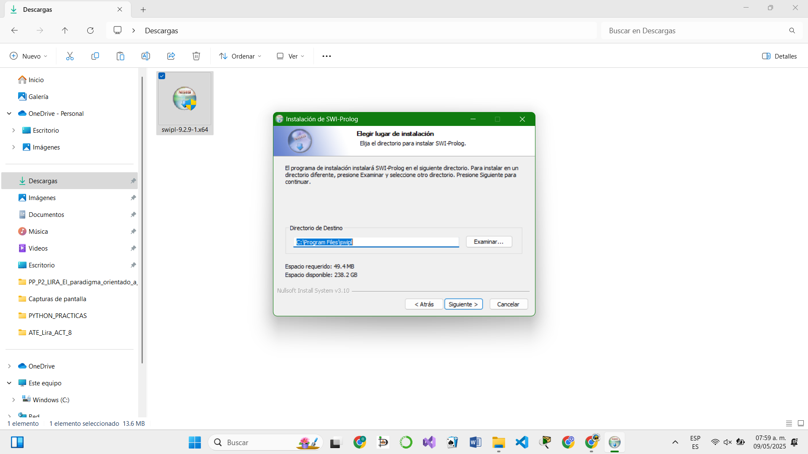
 
La primera sesión se centra en la configuración del entorno de desarrollo y la familiarización con la herramienta. Inicialmente, se descargó el instalador para el entorno SWI-Prolog, para usarla a través de Git Bash. 

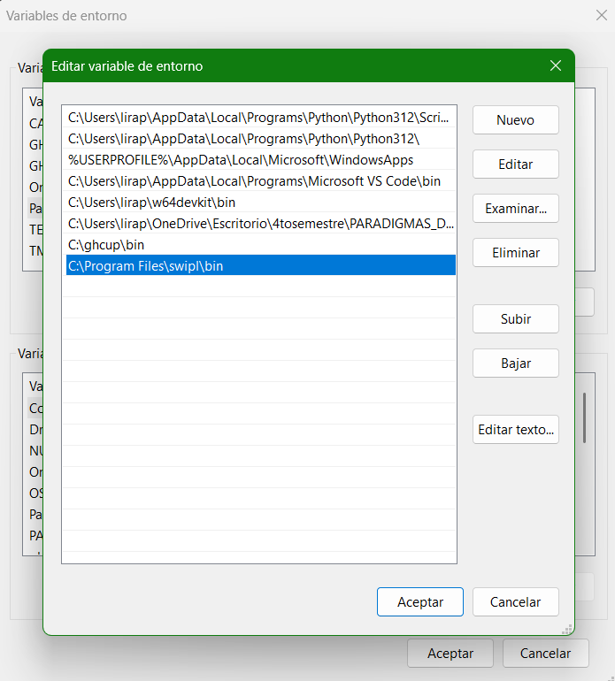
 
Para asegurar un uso más fluido y eficiente de SWI-Prolog, fue necesario realizar ajustes en las variables de entorno del sistema. Una vez configurado, los estudiantes pudieron comenzar a interactuar con el entorno de Prolog.

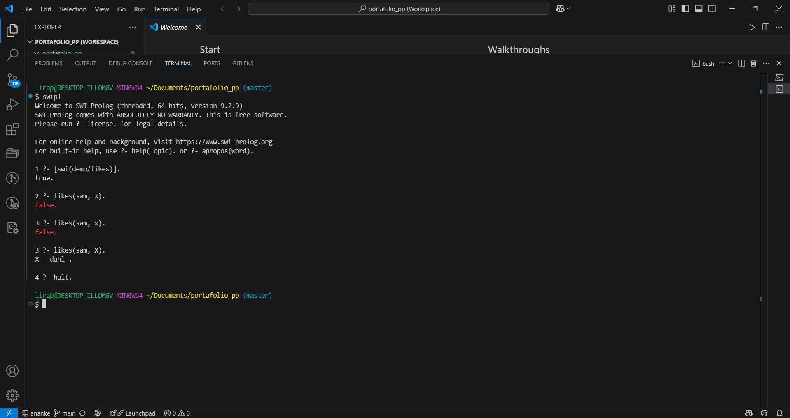
 
El código proporcionado por el docente presentaba una base de conocimientos estructurada en hechos y reglas lógicas.

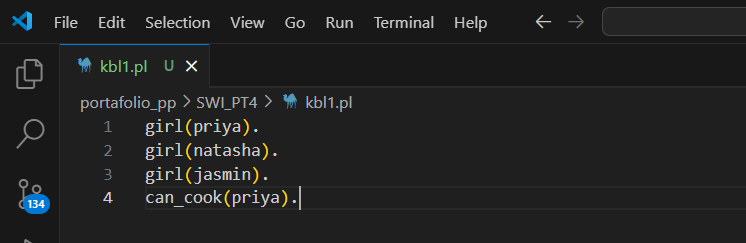
 
La base de conocimientos define hechos simples sobre algunas personas, específicamente sobre si son niñas y si saben cocinar. Cada línea representa un hecho individual.

-	**Hechos:** La base de conocimientos definía hechos simples sobre individuos, como si eran niñas o si sabían cocinar.

-	**Reglas Lógicas:** Más allá de los hechos, el código utilizaba reglas lógicas para representar conocimientos más complejos y deducir nuevos comportamientos o estados a partir de la información existente.

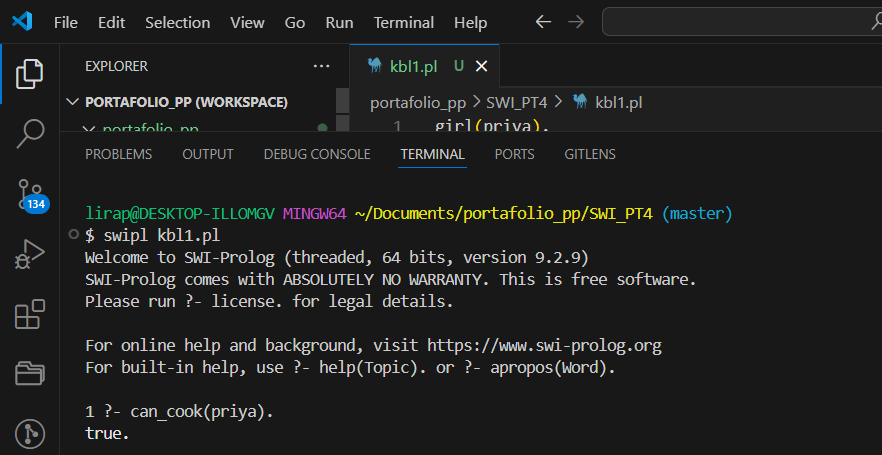

La línea can_cook(priya). añade una característica adicional indicando que Priya sabe cocinar.

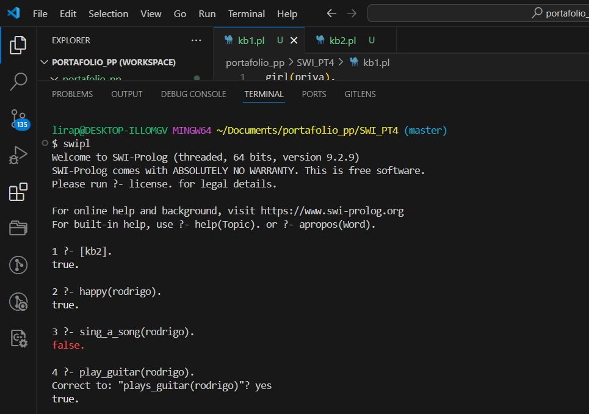
 
Describe ciertas acciones y estados emocionales relacionados con dos personas: Ana y Rodrigo. Primero, se establece que Ana canta una canción y que Rodrigo escucha música.
El código utiliza tanto hechos como reglas lógicas para representar conocimientos y deducir nuevos comportamientos o estados a partir de la información dada.

 
## SEGUNDA SESIÓN

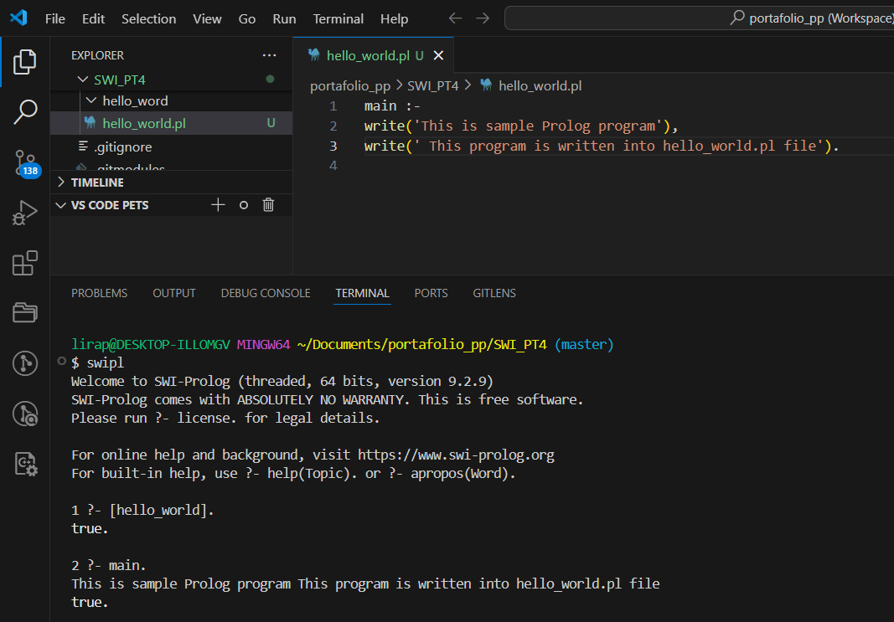
 
Imprime dos mensajes en consola usando el predicado write.

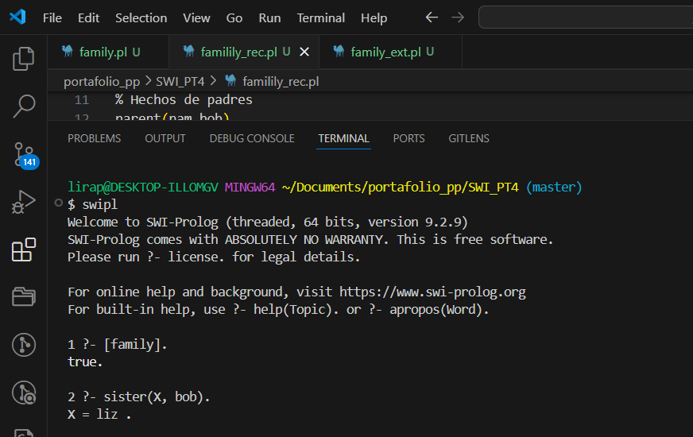
 
Representa relaciones familiares, permitiendo hacer preguntas sobre quién está relacionado con quién basándose en los hechos y reglas definidas.

 
Establece hechos básicos sobre el género de las personas (quién es hombre y quién es mujer) y quién es progenitor de quién. Luego, a partir de estos hechos simples, el código define reglas para relaciones más complejas.

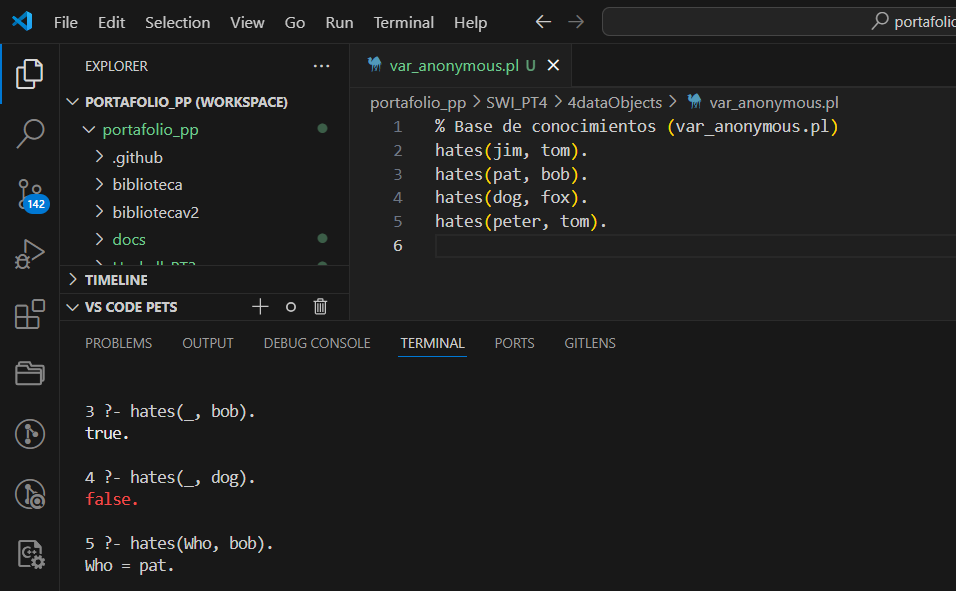
 
Hechos básicos que pueden ser utilizados para consultas directas o como parte de reglas más complejas, aunque no se exploran en este fragmento.

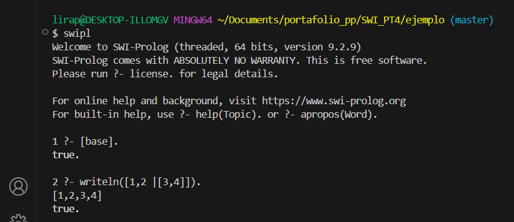

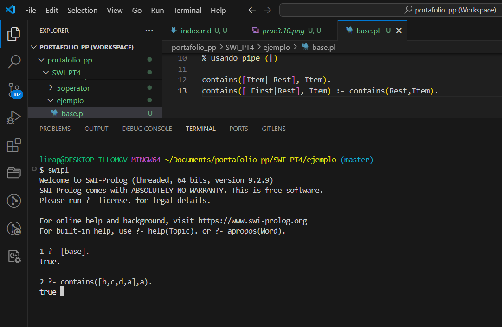

 
Proporciona bloques de construcción básicos para manipular pares y un ejemplo práctico de cómo verificar la presencia de un elemento dentro de una lista utilizando la potente coincidencia de patrones y recursión.

 
## TERCERA SESIÓN

### El problema de las Torres de Hanoi

El Problema de las Torres de Hanói es un rompecabezas clásico que implica mover N discos de una torre de origen a una de destino, utilizando una torre intermedia como auxiliar. Para su resolución, se deben cumplir dos condiciones fundamentales:
-	No se puede colocar un disco más grande sobre uno más pequeño.
-	Solo se puede mover un disco a la vez.

El predicado `move(N,X,Y,Z)` modela el movimiento de N discos desde la torre de origen X a la torre de destino Y, con Z siendo la torre auxiliar. La primera regla, `move(1,X,Y,_)`, constituye el caso base: si solo hay un disco (N=1), este se mueve directamente del origen X al destino Y, y se imprime un mensaje indicando la acción. La segunda regla, `move(N,X,Y,Z)`, maneja el caso recursivo para más de un disco. Primero, se mueven N−1 discos de X a la torre auxiliar Z (usando Y como auxiliar). Luego, el disco más grande (el N-ésimo) se mueve de X a Y. Finalmente, los N−1 discos restantes se trasladan de la torre auxiliar Z al destino Y.

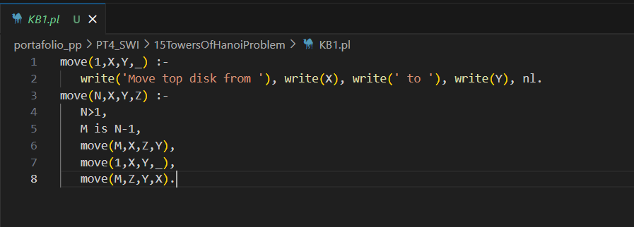

### Listas enlazadas
En Prolog, las listas enlazadas pueden representarse de manera flexible. La lista más elemental es nil (nula), que denota una lista vacía. Cualquier otra lista contendrá nil como el "siguiente" nodo al final. En la terminología de listas, el primer elemento se conoce como la cabeza de la lista, y el resto se denomina la cola. Por ejemplo, en la lista `node(2, node(5, node(6, nil)))`, la cabeza es 2 y la cola es `node(5, node(6, nil))`.

Los predicados presentados demuestran la manipulación básica de listas enlazadas en Prolog. Una lista enlazada se representa como node(Head, Tail), donde Head es el elemento actual y Tail es el resto de la lista.

-	`add_front(L,E,NList)`: Este predicado, que no utiliza recursión, tiene como objetivo añadir un elemento E al inicio de una lista enlazada existente L. El resultado es una NList (nueva lista) donde E se convierte en la nueva cabeza y L en la cola. Es decir, NList se unifica con node(E,L).
-	`add_back(nil, E, NList)`: Esta es la primera regla para añadir un elemento E al final de una lista. Constituye el caso base: si la lista de entrada es nil (vacía), el nuevo elemento E se convierte en el único nodo de la lista, formando node(E,nil).
-	`add_back(node(Head,Tail), E, NList)`: Esta es la regla recursiva. Si la lista no está vacía, se invoca add_back recursivamente con la cola de la lista actual (Tail) para localizar el final. Una vez que add_back(Tail, E, NewTail) unifica NewTail con la cola actualizada (con E añadido al final), el predicado construye NList como node(Head,NewTail), manteniendo la cabeza original y adjuntando la cola ya modificada.
add_front(L,E,NList) :- NList = node(E,L).

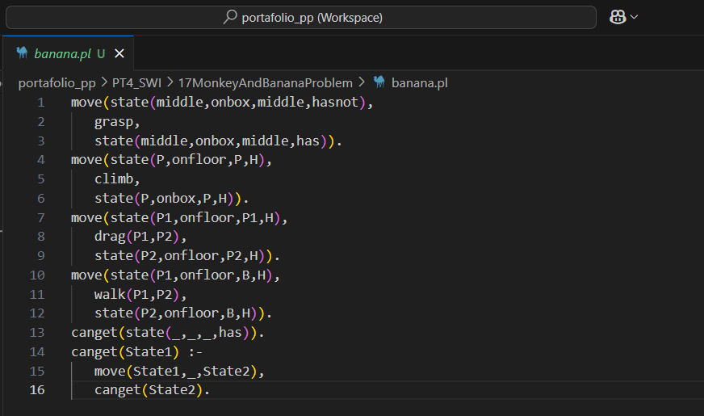
 
### El problema del mono y el plátano
El problema del mono y el plátano es un escenario clásico en inteligencia artificial que se plantea de la siguiente manera:
-	Un mono hambriento se encuentra en una habitación, cerca de la puerta.
-	El mono está en el suelo.
-	Hay plátanos colgados del centro del techo de la habitación.
-	Existe un bloque (o silla) en la habitación, cerca de la ventana.
-	El mono desea los plátanos, pero no puede alcanzarlos directamente.

Las transiciones de estado en este problema se definen mediante el predicado move(State1, Action, State2). Este predicado describe cómo el mundo pasa de un State1 a un State2 al ejecutar una Action. Cada estado se representa como una estructura state(MonkeyPosition, MonkeyState, BoxPosition, HasBananas), que encapsula la ubicación del mono, su estado (en el suelo o en la caja), la posición de la caja y si ya posee los plátanos. Las acciones posibles incluyen: grasp (agarrar los plátanos), climb (subir a la caja), drag(P1, P2) (arrastrar la caja de una posición a otra), y walk(P1, P2) (caminar de una posición a otra).

En segundo lugar, el predicado canget(State) se encarga de determinar si es posible alcanzar el objetivo de tener los plátanos partiendo de un State inicial dado. Esto se logra mediante un proceso de recursión y retroceso, explorando las posibles secuencias de acciones hasta llegar a un estado donde el mono tiene los plátanos

 
## Conceptos fundamentales

### Paradigma lógico
Es el conjunto de hechos y reglas que describen un dominio del conocimiento. En programación lógica, esta base representa el conocimiento declarativo del sistema, es decir, lo que el sistema “sabe”. A partir de ella, se pueden hacer consultas para deducir información nueva o responder preguntas.

### Hechos
Son afirmaciones básicas sobre el mundo que se consideran verdaderas. Representan información concreta en la base de conocimientos.

### Reglas
Son implicaciones lógicas que definen relaciones entre hechos. Permiten inferir nuevos hechos a partir de otros. Una regla tiene una parte condicional ("si") y una parte de conclusión ("entonces").

### Consultas
Son preguntas que se hacen al sistema con base en los hechos y reglas. El sistema usa razonamiento lógico para determinar si la consulta es verdadera o encontrar valores que la hagan verdadera.

### Inferencia
Es el proceso mediante el cual el sistema deduce nuevas verdades o verifica si una afirmación es cierta, basándose en los hechos y reglas definidas. Se basa en la lógica formal, como la resolución y la unificación.

### Consultas con unificación
La unificación es el proceso mediante el cual el sistema de Prolog compara dos términos (pueden ser hechos, variables, listas, etc.) y determina si pueden hacerse idénticos mediante la sustitución de variables.

### Traducción de enunciados naturales a lógica
Consiste en convertir frases del lenguaje natural (español, inglés, etc.) a expresiones formales en lógica de predicados, que Prolog puede interpretar.
 
### ¿Qué es la lógica de predicados?
La lógica de predicados (también llamada lógica de primer orden) es un sistema formal en el que los enunciados lógicos se componen de:
-	Predicados: funciones que expresan relaciones (como padre, mayor_que).
-	Términos: constantes, variables o funciones.
-	Permite representar hechos, relaciones y reglas con más detalle que la lógica proposicional.

### Cláusulas de Horn
Son un tipo especial de fórmulas en lógica de predicados usadas en Prolog. Tienen la forma:
cabeza :- cuerpo.
Donde:
-	Cabeza es un hecho que se quiere probar
-	Cuerpo es una lista de condiciones que deben cumplirse
-	Si no hay cuerpo, es un hecho
-	Si no hay cabeza, es una consulta

### Átomos
Son constantes simbólicas usadas para representar entidades o valores.

### Números
Enteros o decimales (ej. 5, 3.14)

### Variables
Comienzan con mayúscula (ej. X, Nombre)

### Términos compuestos 
Funtor + argumentos

### Sintaxis propias de listas en Prolog
Las listas son estructuras de datos fundamentales en Prolog. Se definen con corchetes [] y elementos separados por comas.
 
### Reglas sobre listas
-	En Prolog se pueden definir reglas recursivas para procesar listas:
-	Contar elementos
-	Verificar si un elemento pertenece a una lista
-	Concatenar listas
-	Invertir listas, etc.

### Consultas de listas
Son preguntas que se hacen al sistema para verificar o encontrar elementos en listas.

### Búsqueda
La búsqueda es el proceso mediante el cual el sistema intenta probar una meta a partir de los hechos y reglas definidos en el programa. Usa encadenamiento hacia atrás (backward chaining), que comienza desde la meta y busca hechos/reglas que puedan ayudar a probarla.

### Diferencia esencial
Unificación es un proceso de comparación estructural: determina si dos términos pueden representar la misma cosa.
